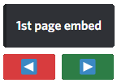
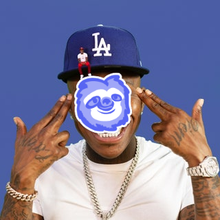
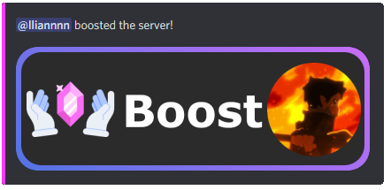

<p align="center">
  
</p>

<h1 align="center">UltraX</h1>

<p align="center">
  <a href="https://www.npmjs.com/package/ultrax">
    
  </a>
  <a href="https://www.npmjs.com/package/ultrax">
    
  </a>
  <a href="https://npmjs.org/package/prompts">
    
  </a>
</p>

<p align="center">
  <b>User-friendly functions and events that makes life easier</b>
  <br />
  <sub>UltraX is a unique package that gives you multiple useful usages using functions and events.</sub>
</p>

<p align="center">
 <a  href="https://nodei.co/npm/ultrax/"></a>
 </p>


  
## ✘ Install

```
$ npm install ultrax
```


## ✘ Table of Content

- **Functions:**

  -  [`sleep()`](https://www.npmjs.com/package/ultrax#sleep) - A simple function that makes it easier to timeout in your code.

  -  [`passGen()`](https://www.npmjs.com/package/ultrax#passgen) - Function to create passwords made by letters and numbers randomly with a specified length.

  -  [`bin()`](https://www.npmjs.com/package/ultrax#bin) - Function to bin code into a [SourceBin](https://sourceb.in/).

  -  [`buttonPaginator()`](https://www.npmjs.com/package/ultrax#buttonpaginator) - Function to create a paginator with buttons.
  
  -  [`welcomeImage()`](https://www.npmjs.com/package/ultrax#welcomeimage) - This function is used to create a welcome image using [canvas](https://www.npmjs.com/package/canvas), fully customizable and fast!

  - [`sussybaka()`](https://www.npmjs.com/package/ultrax#sussybaka) - Create a sussybaka image from an image url.

  - [`dababy()`](https://www.npmjs.com/package/ultrax#dababy) - Create a dababy image from an image url.

  -  [`wikipedia()`](https://www.npmjs.com/package/ultrax#wikipedia) - A simple function to allow you to fetch a topic from Wikipedia and send an embed with the information.

  - [`boostImage()`](https://www.npmjs.com/package/ultrax#boostimage) - Function that creates a booster card, using the [French Noodles API](https://frenchnoodles.xyz/api).

  -  [`remind()`](https://www.npmjs.com/package/ultrax#remind) - Function to make remind command 

- **Events:**
  - [`reminder`](https://www.npmjs.com/package/ultrax#reminder-event) - This event fires when it's time to remind someone of a reminder created by the [Remind Function](https://www.npmjs.com/package/ultrax#remin).
  
  - [`inviteJoin`](https://www.npmjs.com/package/ultrax#invitelogger) - This event fires when a user joins by an invite link from another user, it provides information who joined, by what invite link and who made that invite link.

  - [`boost`](https://www.npmjs.com/package/ultrax#boost-event) - This event emits when the server is boosted and returns the booster as [GuildMember](https://discord.js.org/#/docs/main/stable/class/GuildMember), with all data existing about it.


## ✘ Functions:

### sleep

A simple function that makes it easier to timeout in your code.

```js
(async () => {
  const  { sleep } = require('ultrax');

  console.log('Started!'); // => Logs "Started!"

  await sleep(2000); // => Waits 2 seconds

  console.log('Two seconds passed!'); // => Logs "Two seconds passed!"
})();
```

> `sleep(ms: Number)`

<br />

### passGen

Function to create passwords made by letters and numbers randomly with a specified length.

```js
const  { passGen } = require('ultrax');

console.log(passGen(6));  // => NzA8YT
```

> `passGen(length: Number)`

<br />

### bin

Function to bin code into a [SourceBin](https://sourceb.in/).

```js
(async () => {
  const  { bin } = require('ultrax')

  if (!args[0]) return message.channel.send('What do you want to bin?');

  const url = await bin(args.join(' '));

  console.log(url) // => https://sourceb.in/bFD3tHt1vB
})(); 
```

> `bin(code: String)`

<br />

### buttonPaginator

Function to create a paginator with buttons.

**Example:**

```js
const { buttonPaginator } = require('ultrax');
const { MessageEmbed, MessageButton } = require("discord.js");

const embed1 = new MessageEmbed()
  .setTitle("1st page embed");
const embed2 = new MessageEmbed()
  .setTitle("2nd page embed");
const embed3 = new MessageEmbed()
  .setTitle("3rd page embed");
const embed4 = new MessageEmbed()
  .setTitle("4th page embed");

const buttonBack = new MessageButton()
  .setStyle("DANGER")
  .setEmoji("◀");

const buttonForward = new MessageButton()
  .setStyle("SUCCESS")
  .setEmoji("▶");

await buttonPaginator(message, [embed1, embed2, embed3, embed4], [buttonBack, buttonForward]); // => Replies with a paginated embed to your message
```
> `buttonPaginator(message: Message, embeds: MessageEmbed[], buttons: MessageButton[])`


  

<br />

### welcomeImage

This function is used to create a welcome image using [canvas](https://www.npmjs.com/package/canvas), fully customizable and fast!

**Example:**

A nice welcome image function working inside of a [guildMemberAdd](https://discord.js.org/#/docs/main/stable/class/Client?scrollTo=e-guildMemberAdd) event.

```js
const { welcomeImage } = require('ultrax');

client.on('guildMemberAdd', async member => {
  const bg = 'https://imgur.com/okIR1iY.png';
  const avatar = member.user.displayAvatarURL({ format: "png" });
  const title = "welcome";
  const subtitle = member.user.tag;
  const footer = `You're the ${member.guild.memberCount}th member`;
  const color = '#ffffff';
  const channel = member.guild.channels.cache.get('716220553391767569')
  const options = {
    font: "sans-serif",
    attachmentName: `welcome-${member.id}`,
    title_fontSize: 80,
    subtitle_fontSize: 50,
    footer_fontSize: 30
  };

  const image = await welcomeImage(bg, avatar, title, subtitle, footer, color, options);

  channel.send({ files: [image] });
});
```

> To use a custom font, you need to register your font, and give it a family name, after registering it, you can use the specified family name in the options.
> More information about registering fonts can be found [here](https://www.npmjs.com/package/canvas#registerfont).


<br />

**Parameters:**

| Parameter  | Type                                                                                              | Optional | Description                          |
| ---------- | ------------------------------------------------------------------------------------------------- | -------- | ------------------------------------ |
| background | [String](https://developer.mozilla.org/en-US/docs/Web/JavaScript/Reference/Global_Objects/String) | ✘        | The background for the welcome image |
| avatar     | [String](https://developer.mozilla.org/en-US/docs/Web/JavaScript/Reference/Global_Objects/String) | ✘        | The avatar for the welcome image     |
| title      | [String](https://developer.mozilla.org/en-US/docs/Web/JavaScript/Reference/Global_Objects/String) | ✘        | The title for the welcome image      |
| subtitle   | [String](https://developer.mozilla.org/en-US/docs/Web/JavaScript/Reference/Global_Objects/String) | ✘        | The subtitle for the welcome image   |
| footer     | [String](https://developer.mozilla.org/en-US/docs/Web/JavaScript/Reference/Global_Objects/String) | ✘        | The footer for the welcome image     |
| color      | [String](https://developer.mozilla.org/en-US/docs/Web/JavaScript/Reference/Global_Objects/String) | ✘        | The color for the welcome image      |
| options    | WelcomeImageSettingsOptions                                                                       | ✔        | The options for the welcome image    |

> `welcomeImage(background: String, avatar: String, title: String, subtitle: String, footer: String, color: String, options: WelcomeImageSettingsOptions)`

<br />

**WelcomeImageSettingsOptions**

| Parameter         | Type                                                                                              | Optional | Default    | Description                                                 |
| ----------------- | ------------------------------------------------------------------------------------------------- | -------- | ---------- | ----------------------------------------------------------- |
| font              | [String](https://developer.mozilla.org/en-US/docs/Web/JavaScript/Reference/Global_Objects/String) | ✔        | sans-serif | The font for the text in the welcome image                  |
| attachmentName    | [String](https://developer.mozilla.org/en-US/docs/Web/JavaScript/Reference/Global_Objects/String) | ✔        | welcome    | The name for the attachment that contains the welcome image |
| title_fontSize    | [Number](https://developer.mozilla.org/en-US/docs/Web/JavaScript/Reference/Global_Objects/Number) | ✔        | 72 pixels  | The title's font size for the welcome image                 |
| subtitle_fontSize | [Number](https://developer.mozilla.org/en-US/docs/Web/JavaScript/Reference/Global_Objects/Number) | ✔        | 42 pixels  | The subtitle's font size for the welcome image              |
| footer_fontSize   | [Number](https://developer.mozilla.org/en-US/docs/Web/JavaScript/Reference/Global_Objects/Number) | ✔        | 32 pixels  | The footer's font size for the welcome image                |

> `{ font: String, attachmentName: String, title_fontSize: String, subtitle_fontSize: String, footer: String }`

<br />

### sussybaka

Create a sussybaka image from an image url.

**Example**
```js
const { sussybaka } = require("ultrax");

client.on("messageCreate", async (message) => {
  if (message.content === "!sussybaka") {
    const image = await sussybaka(message.mentions.users.first()?.displayAvatarURL({ format: 'png' }) || message.author.displayAvatarURL({ format: 'png' }));

    return message.channel.send({ files: [image] });
  }
});
```

> `sussybaka(url: String)`


<br />

### dababy

Create a dababy image from an image url.

**Example**

```js
const { dababy } = require('ultrax');

client.on("messageCreate", async (message) => {
  if (message.content === "!dababy") {
    const image = await dababy(message.mentions.users.first()?.displayAvatarURL({ format: 'png' }) || message.author.displayAvatarURL({ format: 'png' }));

    return message.channel.send({ files: [image] });
  }
});
```

> `dababy(url: String)`



<br />

### wikipedia

A simple function to allow you to fetch a topic from Wikipedia and send an embed with the information.

**Example**

```js
const { Wikipeda } = require('ultrax') 

let query = 'earth'

const res = new Wikipedia({ 
	reply: message, // Use 'interaction' instead for any interaction based commands
	color: "RED",
	query: query
});

await res.send();
```

> `new Wikipedia({ message|interaction: Message, interaction: CommandInteraction, color: String, query: String })`


<br />

### boostImage

Function that creates a booster card, using the [French Noodles API](https://frenchnoodles.xyz/api).

**Example**

A nice boost image function working inside of the [Boost Event]([https://npmjs.](https://www.npmjs.com/package/ultrax#boost-event)).

```js
const { MessageEmbed } = require('discord.js');
const { boostImage, boost } = require('ultrax');
boost.init(client);

client.on('boost', async (booster) => {
  const channel = client.channels.cache.get('716239290350436423');
  const avatar = booster.user.displayAvatarURL({ format: 'png' });
  const boostCard = boostImage(avatar);

  let embed = new MessageEmbed()
    .setDescription(`${booster.user.toString()} boosted the server!`)
    .setImage(boostCard)
    .setColor('#FF39F8');
  channel.send({ embeds: [embed] });
});
```

> `boostImage(avatar: String)`



<br />

### remind

Function to create a reminder, to actually triger something after the reminder triggers use the [Reminder Event](https://www.npmjs.com/package/ultrax#reminder-event).
  
**Example**
```js
const { remind } = require("ultrax");

const time = args[0];
const reason = args.slice(1).join(" ");

if (!time) return message.channel.send("Over how long do you want to be reminded?");
if (!reason) return message.channel.send("What do you want me to remind you of?");

remind(message.author.id, time, reason);
message.channel.send("Successfully set a reminder.");
```


# ✘ Events
## Reminder Event

This event fires when it's time to remind someone of a reminder created by the [Remind Function](https://www.npmjs.com/package/ultrax#remind).
  
**Example**

```js
const { reminder, connectToMongoDB } = require("ultrax")
connectToMongoDB('MONGO DB URL');
remind.init(client);

client.on('reminder', (userId, reason, time) => {
	const user = client.users.cache.get(userId);
  user.send(`You asked me \`${time}\` ago to remind you of: \`${reason}\``);
});
```

> `connectToMongoDB(url: String)`
> `remind.init(client: Client)`

## inviteLogger

This event fires when a user joins by an invite link from another user, it provides information who joined, by what invite link and who made that invite link.

**Example:**

```js
const { inviteLogger } = require("ultrax");
inviteLogger.init(client);

client.on('inviteJoin', (member, invite, inviter) => {
  console.log(`${member.user.tag} joined using invite code ${invite.code} from ${inviter.tag}. Invite was used ${invite.uses} time(s) since its creation.`); // => Iliannnn#0001 joined using the invite code Dx7aRg7Q from UltraX#0001. Invite was used 1 time(s) since its creation.
});
```

> `inviteLogger.init(client)` 

## Boost Event

This event fires when a user boosts the server and it provides information about the user who boosted the server, you can make you're boost message a bit more interesting using the [boostImage Function](https://www.npmjs.com/package/ultrax#boostimage).

**Function:**


**Example:**

```js
const { boost } = require('ultrax');
boost.init(client);

client.on('boost', async (booster) => {
	const boostChannel = client.channels.cache.get('716239290350436423');

	boostChannel.send({ content: `${booster} boosted the server!` });
});
```


# ✘ Contact us

In case you have idea's to improve the package, or maybe you found some bugs or you need help, you can contact us in our Discord server!

<a  href="https://www.discord.gg/Qk6j2fpeat"></a>
